# Clash of Clans ML Lab

A machine learning laboratory and end-to-end ML pipeline built around real data from the Clash of Clans Developer API.

The project applies multiple supervised and unsupervised machine learning techniques to large-scale Clash of Clans data, following the complete workflow of a real ML project: data extraction, exploratory data analysis, preprocessing, feature engineering, model training, hyperparameter optimization, evaluation, experiment tracking, and result analysis.

## 📌 Overview

### What Is This Project?

**Clash of Clans ML Lab** is a machine learning project built on data from the official Clash of Clans Developer API. Rather than focusing on a single prediction problem, it's structured as an **ML laboratory**: five different problems, derived from the same domain, each explored with its own models and evaluation.

| # | Problem | Type |
|---|---|---|
| P1 | Clan Member Role Classification | Classification |
| P2 | Clan Rank Regression | Regression |
| P3 | Clan War Performance Regression | Regression |
| P4 | Clan Performance Classification | Classification |
| P5 | Player Clustering | Unsupervised (clustering) |

Around these five problems, the project also includes exploratory data analysis, data preprocessing and feature engineering, multiple algorithms per problem, hyperparameter optimization (manual tuning, randomized search, and Optuna), model comparison, experiment tracking with MLflow, and result visualization. The goal isn't just to train models — it's to implement the complete process of turning raw data into reproducible machine learning experiments.

### Motivation

Before this project, I had already spent time on the mathematical foundations behind algorithms like regression, classification, and clustering — I could follow what was happening in theory. What I hadn't done was close the gap between that theory and actually implementing a machine learning project in code, without relying on AI to write it for me.

Rather than continue with small datasets and isolated exercises, I wanted a more serious project on larger, real-world data, and to genuinely understand:

- How data becomes usable features.
- How ML datasets are constructed.
- How models are implemented and trained.
- How different algorithms behave on the same problem.
- How hyperparameters affect performance.
- How to evaluate and interpret models.
- How to structure a reproducible ML project.

I also wanted to go beyond the models themselves and start introducing **MLOps practices** — which is why **MLflow** was integrated from early on, to track experiments, parameters, metrics, models, and artifacts.

### Project Approach

The project combines two perspectives. As an **ML Laboratory**, each problem is an independent experiment: different algorithms, preprocessing strategies, hyperparameters, and evaluation methods are tested and compared. As an **End-to-End ML Pipeline**, it also follows a complete workflow from raw data to tracked results:

```text
Clash of Clans API
        ↓
Raw JSON Data
        ↓
Data Extraction & Normalization
        ↓
Exploratory Data Analysis
        ↓
Data Preprocessing
        ↓
Feature Engineering
        ↓
Problem-Specific Datasets
        ↓
Model Training
        ↓
Hyperparameter Optimization
        ↓
Evaluation & Analysis
        ↓
MLflow Experiment Tracking
        ↓
Results & Artifacts
```


## 🏗️ Project Architecture

The project is organized around one shared source of raw data and five independent machine learning pipelines. All five problems start from the same raw Clash of Clans JSON data, but each defines its own dataset, feature engineering, and target — there is no single shared feature pipeline.

### Problem-Specific Pipelines

Each problem lives under its own section of the `models` directory and follows the same general shape:

```text
Raw JSON Data
      ↓
Build Dataset
      ↓
┌───────────────────────────┐
│ Problem-Specific Features │
│                            │
│ • Clan Features            │
│ • Player Features          │
└───────────────────────────┘
      ↓
Problem Dataset
      ↓
Model Training & Evaluation
      ↓
MLflow
```

Feature engineering is split into **clan-level** and **player-level** features where both are relevant; problems that only need clan-level information skip player-level features entirely, keeping each dataset focused on what its target actually needs.

### Independent ML Pipelines

The five problems are deliberately kept separate rather than built as variations of one shared pipeline. Each has its own dataset construction, feature engineering, dataset, model implementations, training scripts, evaluation process, and results/artifacts — making it possible to experiment with each independently while keeping all five reproducible and isolated from one another.

### Experiment Tracking

**MLflow** is the experiment-tracking layer across all five pipelines, recording runs, models, artifacts, parameters, and metrics consistently — including for later additions like randomized search and Optuna. See *Machine Learning Engineering*, below, for details.

## 📊 Dataset

### Data Collection

The crawler discovers **clans** through the Clash of Clans API, then collects their members and player profiles. Rather than relying on the top clans the API returns by default, it uses a **diversified search strategy** across three filter dimensions:

| Dimension | Ranges | Count |
|---|---|---:|
| Members | 2–10, 11–20, 21–30, 31–40, 41–50 | 5 |
| Clan level | 2–5, 6–10, 11–15, 16–20 | 4 |
| Clan points | 1–1,000 · 1,001–3,000 · 3,001–5,000 · 5,001–10,000 · 10,001–40,000 · 40,001–999,999 | 6 |

Combining these produces **15 single-dimension** and **74 two-dimension** search configurations — **89 in total**. Three-dimensional combinations are not currently used.

The crawler keeps a history of previously used configurations so that successive runs explore new areas of the search space instead of repeating the same queries:

```text
Generate Search Configurations
            ↓
Check Search History
            ↓
Select Unused Configurations
            ↓
Query Clash of Clans API
            ↓
Store Retrieved Data
            ↓
Register Configuration as Used
```

The main bottleneck is the API itself, so the goal of this strategy isn't raw crawl speed — it's maximizing the odds that each run surfaces **new clans and players**.

### Raw Data

The crawler stores collected data as raw JSON files across three entity types:

```text
data/raw/
├── clans/
├── clan_members/
└── players/
```

The crawler is responsible for **data acquisition and storage only** — not preprocessing or feature engineering.

Players are stored as unique entities: once a profile is downloaded, it isn't re-queried to build historical snapshots. The dataset therefore represents each player's state at the time of their first extraction, and diversity comes primarily from discovering new clans and players rather than resampling existing ones over time.

### Dataset Construction

Python scripts transform the raw JSON into **problem-specific Parquet datasets**. Each of the five problems has its own dataset builder, performing the feature engineering that problem needs and drawing on clan data, player data, or both, depending on the target:

```text
Raw JSON Data
      ↓
Problem-Specific Dataset Builder
      ↓
Feature Engineering
      ↓
Problem-Specific Parquet Dataset
      ↓
ML Pipeline
```

This keeps each dataset purpose-built for its own machine learning objective rather than forcing every problem into a single shared feature representation.

### Final Datasets

```text
data/datasets/
├── P1 dataset
├── P2 dataset
├── P3 dataset
├── P4 dataset
└── P5 dataset
```

All five datasets originate from the same raw data but differ in feature engineering, selected variables, and target. The largest is the player-clustering dataset (P5), with approximately **836,000 players**. Detailed characteristics and distributions for each dataset are covered in *Machine Learning Problems*, below.

## 🔎 Exploratory Data Analysis

EDA was performed independently for each of the five problems, after their datasets were built. Its purpose wasn't only to visualize the data, but to understand feature and target distributions, validate dataset quality, and support feature-engineering decisions. For each problem, the analysis covered:

- Feature and target distributions
- Missing values and potential outliers
- Pearson and Spearman correlation
- Relationships between features and targets
- Problem-specific analyses (e.g. the trophies proxy audit in P2 — see below)

Because preprocessing and dataset construction happened before EDA, the datasets were already clean by this stage; EDA mainly served to understand the resulting data rather than to correct it. Problem-specific results and figures are presented together with each problem in *Machine Learning Problems*; this section covers the methodology that was common across all five.

### Correlation Analysis

Both **Pearson** and **Spearman** correlation were used to study relationships between variables. This distinction mattered because a high correlation doesn't automatically justify removing a feature — many Clash of Clans variables are naturally correlated, since the game is built around player progression. A player's **Town Hall level**, for instance, is naturally related to troop levels, spell levels, and other progression variables. Removing a feature purely because it correlates strongly with another risks discarding meaningful information. Correlation analysis was therefore used to **understand the data and flag potentially problematic relationships**, not as an automatic feature-removal rule.

### Target and Feature Distributions

Distributions were analyzed separately for each problem, in the context of its specific objective, to identify highly concentrated or skewed variables, extreme values, class imbalances, strong inter-variable relationships, and potentially redundant or proxy features. The resulting visualizations inform the feature and modelling decisions described for each problem.

### EDA Findings

The EDA confirmed that the processed datasets were suitable for modelling, and reinforced one overarching lesson: feature selection can't be reduced to "remove whatever correlates highly." In a progression-based game like Clash of Clans, many correlations reflect genuine relationships between player characteristics rather than redundant information — a theme that recurs throughout the five problems, most directly in P2's trophies audit.

## 🧪 Machine Learning Problems

### P1 — Clan Member Role Classification

#### Objective

Predict a player's role within their clan, based primarily on **player-level characteristics** rather than clan-level information. The target is `role`, with four classes:

```text
member
admin
coLeader
leader
```

The dataset's `admin` category isn't a standard role name in the current Clash of Clans role system; based on its behavior in the data, it was interpreted as corresponding to the **Elder** role. P1 was treated as a four-class classification task.

#### Features

- **Clan context:** clan level, War League, Clan Capital points, and other clan-level characteristics.
- **Player characteristics:** Town Hall level, troop levels and progression, hero levels, spell levels, and other progression/activity features.

The goal was to test whether a player's assigned role can be inferred from their in-game characteristics and progression.

#### Target Distribution

Classes were kept as balanced as possible during dataset construction, with one unavoidable exception: `leader`, since a clan has only one leader, making this class inherently harder to balance than the others.

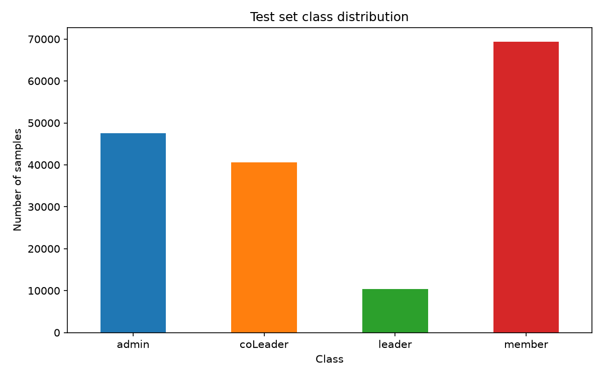

#### Models and the `leader` Class

Three classifiers were evaluated — **Logistic Regression**, **Random Forest**, and **XGBoost** — initially tuned through a simple, iterative manual process (an intentionally straightforward starting point, before more systematic search methods were introduced later in the project).

Because leaders are so rare, overall accuracy alone would understate how poorly a model identifies them. **Class weighting** was used to address this: the `leader` class was given roughly **3–4× more weight** during training.

#### Evaluation

Models were compared using per-class **precision, recall, and F1-score**, with **F1-score as the primary metric** — accuracy alone could hide poor performance on the minority `leader` class.

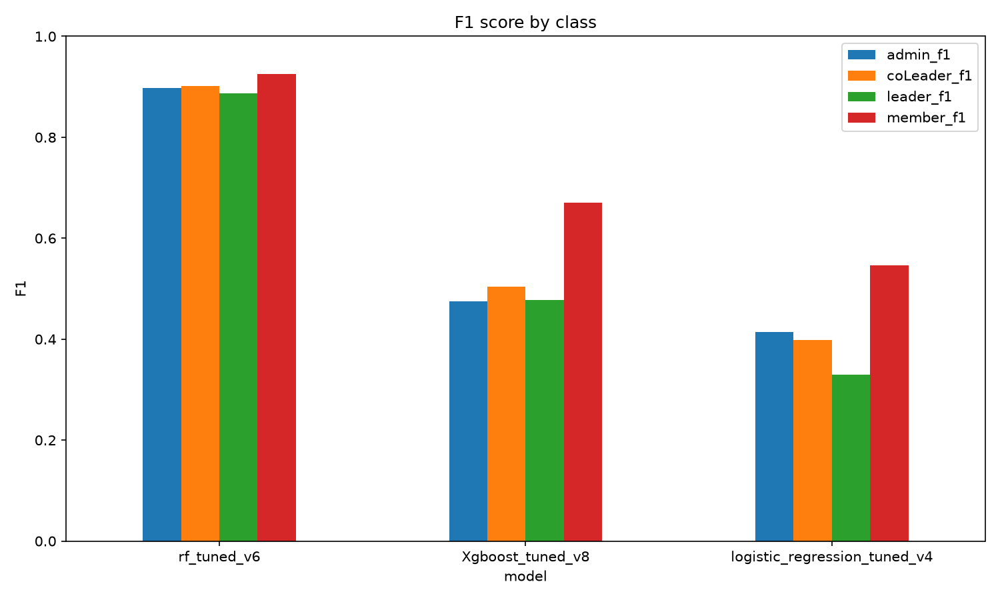

#### Results

| Model | Accuracy | F1 Weighted | F1 Macro | Admin F1 | CoLeader F1 | Leader F1 | Member F1 |
|---|---:|---:|---:|---:|---:|---:|---:|
| **Random Forest** | **0.5547** | **0.5459** | **0.4980** | **0.4452** | **0.5104** | 0.3762 | **0.6603** |
| XGBoost | 0.5398 | 0.5345 | 0.4955 | 0.4389 | 0.4705 | **0.4185** | 0.6542 |
| Logistic Regression | 0.4521 | 0.4624 | 0.4236 | 0.4177 | 0.4002 | 0.3271 | 0.5494 |

**Random Forest** had the best overall accuracy and weighted/macro F1, but **XGBoost** identified the `leader` class better despite lower overall scores.

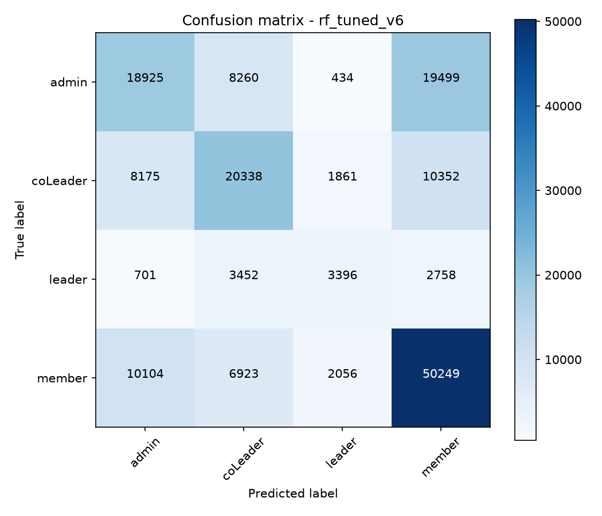

#### Key Takeaways

- Random Forest had the best overall performance; XGBoost was stronger specifically on the `leader` class.
- Logistic Regression was the weakest model overall.
- The `member` class was consistently easier to classify than the leadership-related roles.
- The `leader` class remained difficult even with class weighting — a limitation of the problem (only one leader per clan) rather than of the modelling approach.
- Overall accuracy alone does not represent per-class performance fairly.

### P2 — Clan Rank Regression

#### Objective

Predict `clan_rank` — a player's position within their clan, from **1 to 50** — from their progression, characteristics, and available clan context.

> **Can we predict a player's position within their clan from characteristics such as Town Hall level, troops, progression and other player and clan features?**

#### Dataset & Features

Two dataset variants were built to measure how much predictive value comes specifically from trophy-related features.

The **with-trophies** dataset uses the full feature set. The **without-trophies** dataset removes:

```text
trophies
trophies_diff_from_clan_mean
trophies_ratio_to_clan_mean
trophies_clan_pct
best_trophies
progression_ratio_trophies
clan_mean_trophies
required_trophies
```

The remaining features describe Town Hall level, player progression, troop and hero/spell progression, clan characteristics, and other player/clan attributes — letting the models attempt to infer clan position without directly using trophy information.

#### Proxy and Leakage Audit

Before building the two variants, an audit checked whether `trophies` and other candidates — `town_hall_level`, `exp_level`, `war_stars`, `attack_wins`, `defense_wins`, `donations`, `donations_received`, `capital_contributions`, and `builder_base_trophies` — were acting as **proxies for `clan_rank`** rather than legitimate predictors. For each variable, Spearman correlation with `clan_rank` was computed **within individual clans**, then summarized across clans.

For `trophies`, the audit found:

| Metric | Value |
|---|---:|
| Median Spearman correlation | **−0.3963** |
| 90th percentile of absolute correlation | **1.0** |
| Clans with absolute correlation > 0.9 | **17.28%** |

A strong correlation wasn't treated as automatic evidence of leakage. Historically, trophies had a direct relationship with clan rank, but the introduction of **league floors** — trophy thresholds tied to Town Hall level — weakened that direct relationship while making Town Hall level itself more informative about a player's league placement. Trophies still help differentiate players within a league and reset on a **weekly cycle**. Rather than assume leakage or dismiss it, the project measured the effect empirically by comparing model performance with and without trophies.

#### Models

Three regression approaches were compared: **Ridge Regression**, **Random Forest**, and **XGBoost**. Random Forest proved expensive to tune extensively, so **XGBoost**, optimized with **Optuna**, became the main candidate for systematic hyperparameter search — and produced the best-performing model in both dataset variants.

#### Evaluation

Models were scored with **MAE** (average error, in ranking positions), **RMSE** (penalizes larger errors more), and **R²** (variance in `clan_rank` explained by the model).

#### Results

**With trophies:**

| Model | MAE | RMSE | R² |
|---|---:|---:|---:|
| **XGBoost + Optuna** | **2.0537** | **3.3092** | **0.9134** |
| Random Forest v2 | 2.0882 | 3.4162 | 0.9077 |
| Ridge Regression | 3.96 | 5.293 | 0.77 |

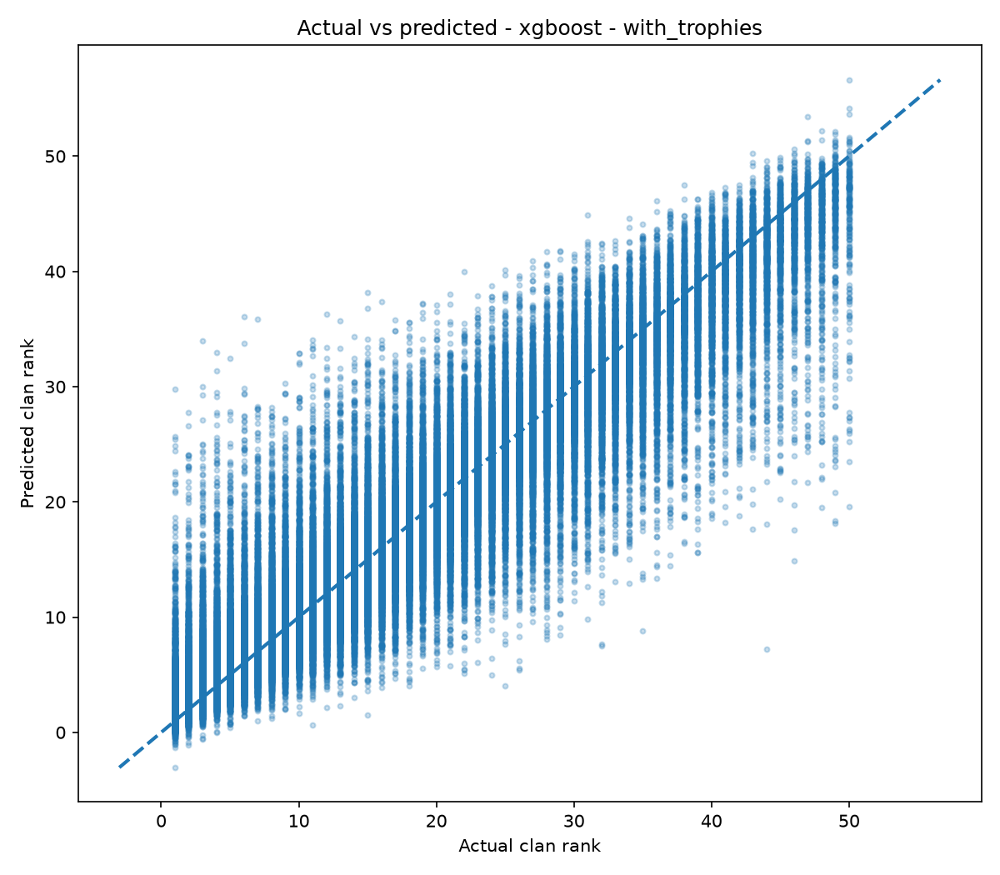

**Without trophies:**

| Model | MAE | RMSE | R² |
|---|---:|---:|---:|
| **XGBoost + Optuna** | **2.5287** | **3.8863** | **0.8805** |
| Random Forest v2 | 2.5836 | 3.9731 | 0.8751 |
| Ridge Regression | 4.1836 | 5.5754 | 0.7541 |

| Dataset | Best Model | MAE | RMSE | R² |
|---|---|---:|---:|---:|
| **With trophies** | XGBoost + Optuna | **2.0537** | **3.3092** | **0.9134** |
| **Without trophies** | XGBoost + Optuna | **2.5287** | **3.8863** | **0.8805** |

Removing trophy-related features raised MAE and RMSE and lowered R², as expected — but the model still explained **88.05%** of the variance in `clan_rank` without them, showing that trophies improve performance without being the only usable signal.

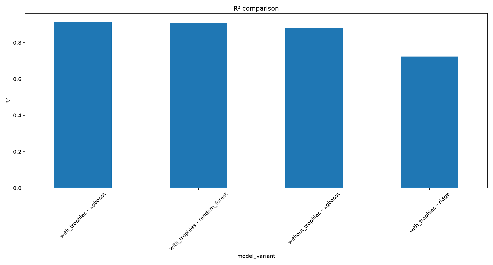

#### Why Are Trophies Predictive?

```text
Town Hall / Player Progression
            ↓
      League Context
            ↓
         Trophies
            ↓
    Relative Position
            ↓
        Clan Rank
```

Town Hall level determines a player's league context (via league floors), and trophies then provide additional information about relative position within that context — which is why both groups of features are predictive without trophies necessarily representing leakage.

#### Feature Importance

Across the evaluated models, features such as `members`, `league_tier_id`, and `town_hall_level_clan_pct` were consistently among the most important, though their exact ranking varied by model and dataset variant.

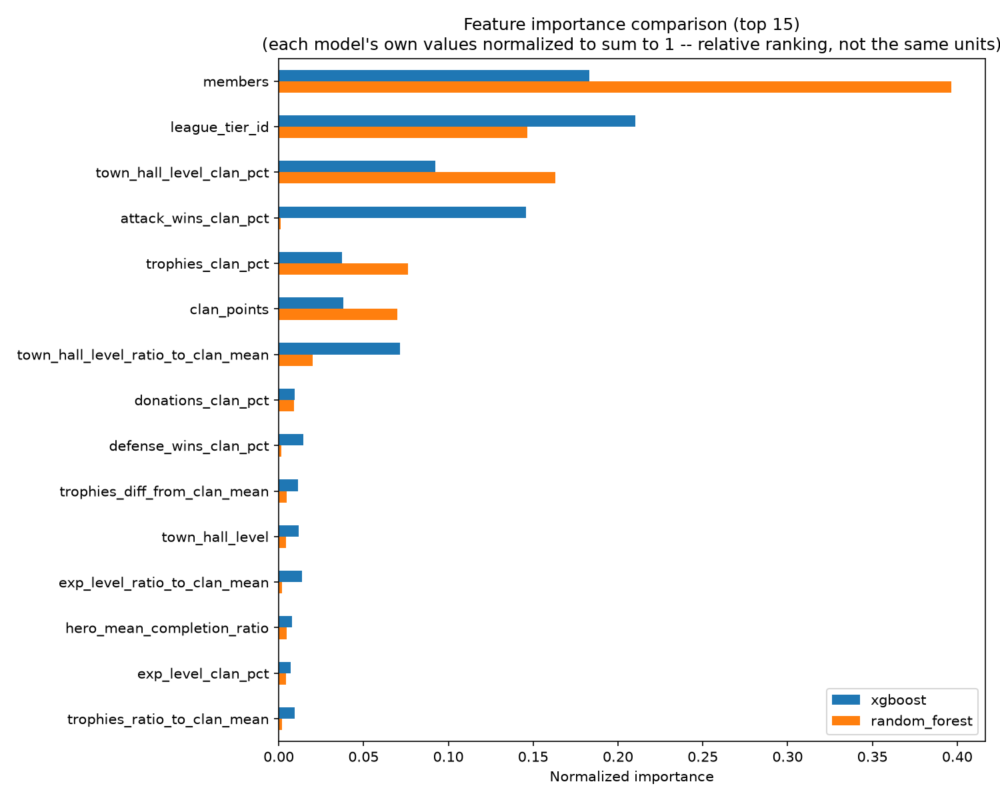

#### Analysis

Removing a highly predictive group of features didn't make the model useless — the remaining player and progression features still let XGBoost explain roughly **88%** of the variance in clan rank. This reinforced a broader lesson from the EDA: strong correlation with a target should be investigated, not assumed to be leakage. XGBoost was the strongest model in both dataset variants; more generally across the project, **XGBoost performed particularly well on the regression problems**, while Random Forest was comparatively stronger on the classification problems.

#### Model Reproducibility: A Feature-Mismatch Lesson

Loading a trained model from MLflow isn't just a matter of the model file existing — the feature representation used at inference must match training. During P2's development, a saved XGBoost model was reloaded with a different number of features than it was trained on. The model was retrained on the correct, aligned feature set, and MLflow's stored model signatures, feature names, and expected feature count were used to validate consistency going forward (see *Machine Learning Engineering* for the general lesson this taught the project).

#### Key Takeaways

- Strong correlation does not automatically mean data leakage — potential proxy variables should be investigated, not removed blindly.
- Comparing models with and without a potentially dominant feature group quantifies its actual contribution.
- Trophy-related variables clearly help, but aren't essential: the model reached R² = 0.8805 without them.
- **XGBoost + Optuna** achieved the best results in both variants: **R² = 0.9134 with trophies, 0.8805 without**.
- Optuna gave a more systematic approach to XGBoost tuning than manual search.
- A trained model's feature representation must be preserved and validated alongside the model artifact itself.

### P3 — Clan War Performance Regression

#### Objective

P3 investigates whether a clan's **historical** war performance can be explained by its characteristics — using the clan's existing war record to build a performance metric, rather than attempting to predict genuinely future results. The target is:

```text
war_success_rate = war_wins / war_total
```

> **Can a clan's war performance be explained by its characteristics and available clan-level information?**

This is a **regression problem**: the model estimates a continuous performance measure rather than a discrete class (P4, below, reframes the same question as classification).

#### Dataset Construction

Clans with too little war history were filtered out before calculating the target:

```python
valid_clans = clans[clans["war_total"] >= min_war_total].copy()
valid_clans["war_success_rate"] = (
    valid_clans["war_wins"].astype(float)
    / valid_clans["war_total"].replace(0, np.nan)
)
```

Rows where a valid rate couldn't be computed were removed. The final dataset contains **31,289 rows** and **51 columns**; after removing identifiers, metadata, and the target, **44 features** were used for training. The features describe general clan-level characteristics only — no future war results are used as predictors.

#### Models and Results

Three regression models were introduced progressively, from simplest to most flexible:

| Model | MAE | RMSE | R² |
|---|---:|---:|---:|
| Linear Regression | 0.1071 | 0.1366 | 0.0764 |
| Random Forest + Randomized Search | 0.0986 | 0.1262 | 0.2113 |
| **Gradient Boosting + Optuna (30 trials)** | **0.0980** | **0.1255** | **0.2206** |

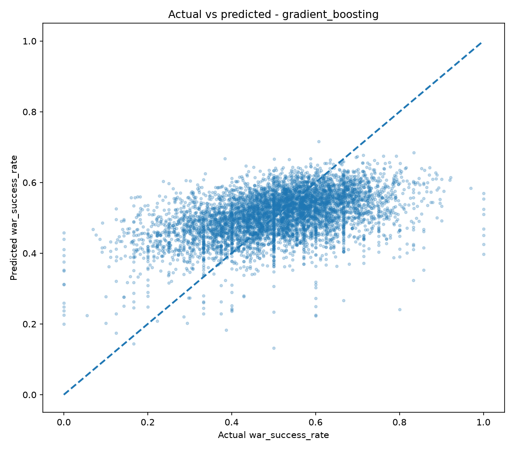

**Linear Regression** served as a baseline to see how much of the target a simple linear relationship could explain; its low R² suggested the problem was harder than the project's other regression tasks. **Random Forest**, tuned with randomized search, improved on the baseline, confirming the presence of non-linear relationships — though overall predictive power stayed limited. **Gradient Boosting**, optimized with **30 Optuna trials**, was chosen as a different boosting approach (after XGBoost had already been used heavily elsewhere) and became the best-performing model, though only marginally ahead of Random Forest.

#### Feature Importance

`clan_rank` was one of the most prominent features — intuitive, since a clan's overall rank is generally tied to a longer progression history, which also relates to accumulated war experience.

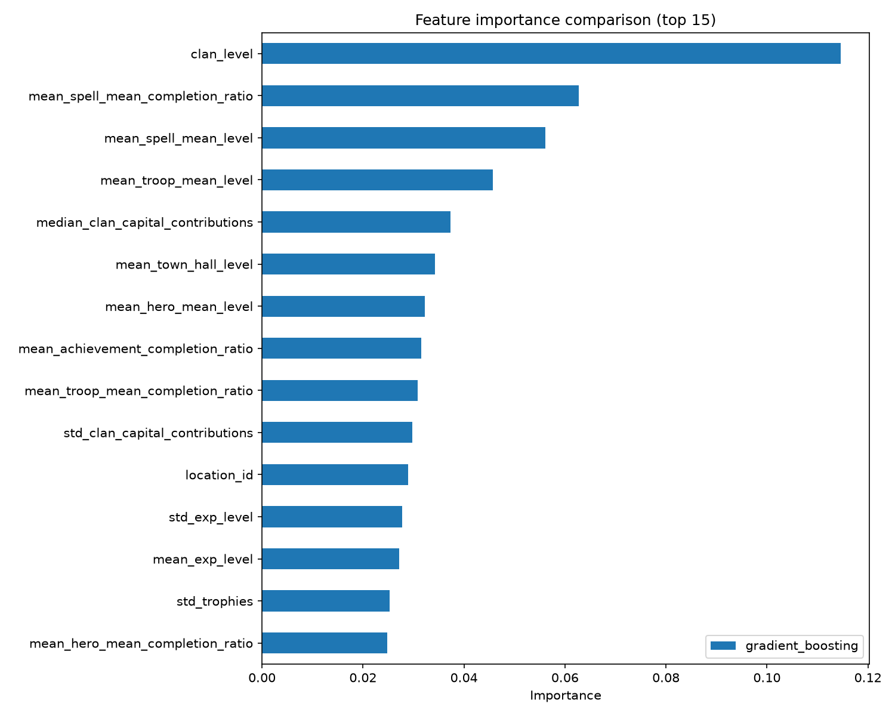

#### Analysis

```text
Linear Regression              R² = 0.0764
        ↓
Random Forest                  R² = 0.2113
        ↓
Gradient Boosting + Optuna     R² = 0.2206
```

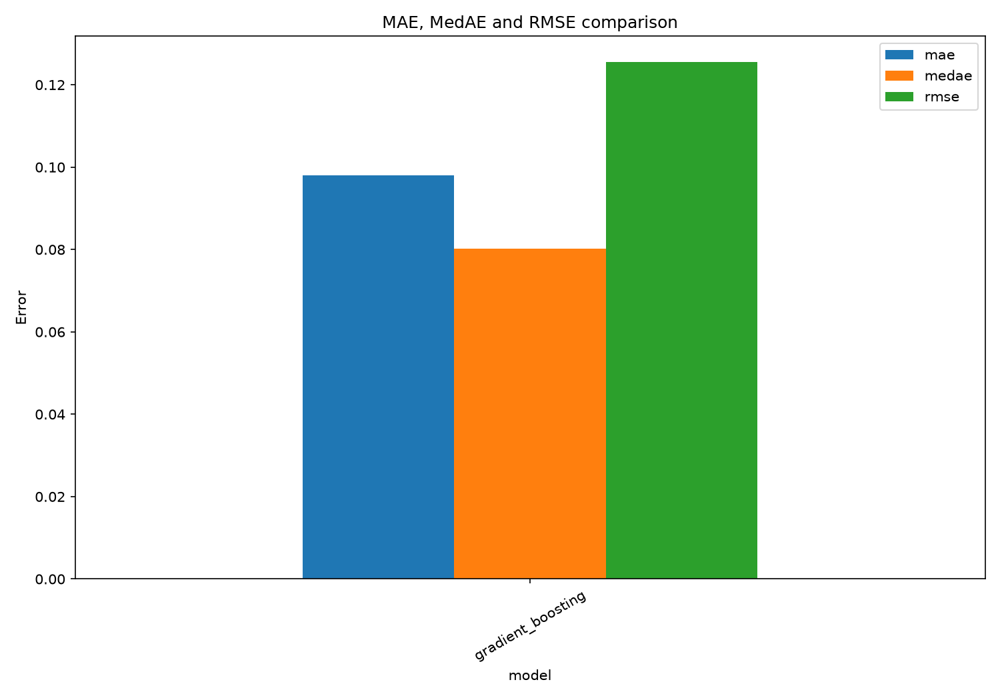

Non-linear models clearly beat the linear baseline, but added complexity produced only a small further gain — the final R² of **0.2206** indicates that the available clan-level characteristics explain only part of the variability in historical war performance. This was a somewhat unexpected result. One possible contributing factor is that some communities deliberately coordinate war outcomes for purposes such as resource farming (e.g. **Friendly War Arrangements**), but this experiment found no evidence that such behavior was the primary explanation. The more likely conclusion is simply that **war performance is a difficult quantity to explain from the available features**, not that the dataset hides one specific unaccounted-for factor.

#### Key Takeaways

- The objective was to explain **historical** war performance, not predict future outcomes.
- `war_success_rate = war_wins / war_total`, computed only for clans with sufficient war history.
- Tree-based models clearly outperformed the Linear Regression baseline.
- **Gradient Boosting + Optuna** achieved the best result: **R² = 0.2206**.
- `clan_rank` was the most prominent feature.
- Increasing model complexity did not solve the problem's underlying difficulty — a lesson that motivated reframing the problem as classification in **P4**.

### P4 — Clan Performance Classification

#### Objective

P4 asks the same underlying question as P3 — can a clan's war performance be explained by its characteristics? — but reframes it as classification:

> **Can a clan's war performance be classified based on its characteristics and available clan-level information?**

Instead of predicting a continuous `war_success_rate`, P4 predicts a `performance_class` with three categories:

```text
low
medium
high
```

derived using two configurable thresholds:

```text
war_success_rate < low_threshold                   → low
low_threshold ≤ war_success_rate < high_threshold   → medium
war_success_rate ≥ high_threshold                   → high
```

This reformulation was motivated directly by P3's difficulty: predicting an exact continuous value proved hard, so P4 tests whether grouping performance into categories makes the problem more tractable.

#### Dataset Construction

P4 uses the same underlying dataset and features as P3, with `war_success_rate` replaced by `performance_class`. As in P3, variables that directly encode war outcomes are excluded from the features to prevent leakage:

```text
war_wins, war_losses, war_ties, war_win_streak, war_points,
war_total, war_success_rate, win_rate, loss_rate, tie_rate
```

#### Target Distribution

Unlike P1, the class boundaries here were controllable, so the classes were deliberately balanced:

| Class | Proportion |
|---|---:|
| Medium | 33.42% |
| Low | 33.32% |
| High | 33.25% |

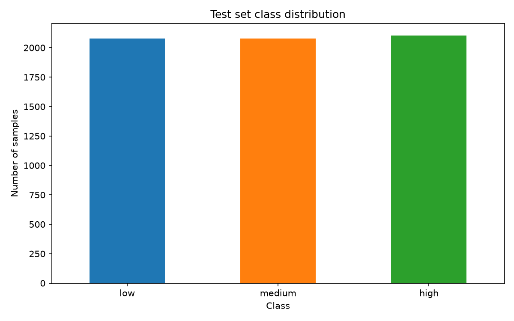

With three roughly equal classes, a random classifier would score about **33.3%** accuracy — the baseline the models are measured against.

#### Models

Three classifiers were evaluated: **Random Forest**, **XGBoost**, and a **Multi-Layer Perceptron (MLP)**. The MLP was added specifically for P4 to test whether a neural-network classifier could be integrated using **scikit-learn and Optuna**, without needing a separate PyTorch implementation.

#### Hyperparameter Optimization

**XGBoost** and the **MLP** were each given **50 Optuna trials** — partly to search for better configurations, and partly to test whether a larger optimization budget than used elsewhere in the project would pay off. Random Forest was evaluated without this 50-trial search.

#### Evaluation

Because the classes are balanced, models were compared on **accuracy, balanced accuracy, macro F1, and weighted F1** — macro F1 in particular, since it weighs all three classes equally.

#### Results

| Model | Accuracy | Balanced Accuracy | F1 Macro | F1 Weighted |
|---|---:|---:|---:|---:|
| Random Forest | 0.4811 | 0.4811 | 0.4773 | 0.4775 |
| XGBoost + Optuna | 0.4986 | 0.4985 | 0.4925 | 0.4926 |
| **MLP + Optuna** | **0.5037** | **0.5038** | **0.4962** | **0.4962** |

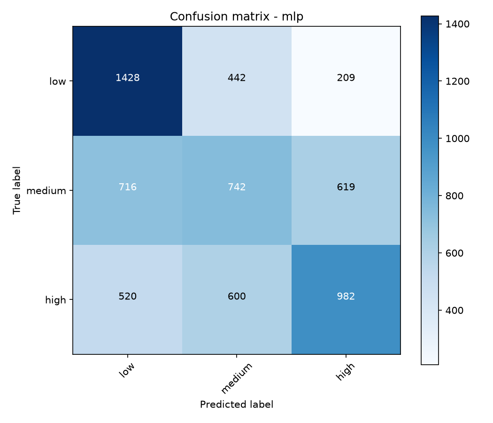

**MLP + Optuna** was best overall, though by a small margin over XGBoost. At roughly **50.4%** accuracy against a **33.3%** random baseline, the models captured meaningful signal — while still leaving the task far from solved.

#### Analysis

P4 performed substantially better than P3's regression formulation, suggesting that classifying a clan into a performance tier is more tractable than predicting its exact `war_success_rate`. Confusion matrices show the **low** and **high** classes are easier to separate than **medium**, whose clans sit close enough to both neighboring categories that their characteristics can overlap with either — the classification framing didn't make the problem easy, it changed the kind of uncertainty involved. More broadly, this comparison shows that **problem formulation can matter as much as model choice**: the same underlying data and predictive signal produced a much more workable task once reframed as classification.

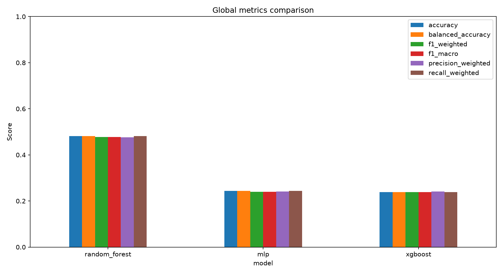

#### Key Takeaways

- P4 reuses P3's underlying data and features, replacing `war_success_rate` with a three-way `performance_class`.
- Classes were deliberately balanced (~33% each) to avoid an artificial imbalance problem.
- XGBoost and MLP were each optimized with 50 Optuna trials; Random Forest was not.
- **MLP + Optuna** achieved the best result: **50.37% accuracy, 0.4962 macro F1** — meaningfully above the ~33.3% random baseline.
- The `medium` class was harder to classify than `low` or `high`.
- Reframing a difficult regression problem as classification made the underlying signal more tractable, without changing what information was actually available.

### P5 — Player Clustering

#### Objective

Discover whether Clash of Clans players fall into natural groups based on their characteristics — an **unsupervised** problem, with no predefined target or labels.

> **What types of players can be identified based on their characteristics and progression?**

Relevant features include Town Hall level, player progression, league and trophy statistics, donations and donation ratios, war activity, Clan Capital contributions, and troop/hero/spell/equipment progression.

#### Dataset

The largest dataset in the project: approximately **836,000 players**, **31 columns**, of which **30 features** are used for clustering (no target variable). **370 duplicated feature rows** were kept rather than dropped, since they can represent genuinely different players who happen to share identical values across every clustering feature.

#### Preprocessing

Features were standardized with `StandardScaler` before clustering. This mattered because features such as `town_hall_level`, `donation_ratio`, `clan_capital_contributions`, and `best_trophies` operate on very different numeric scales, and distance-based clustering algorithms are sensitive to that — without scaling, large-range variables would dominate the distance calculations.

#### K-Means

**K** was tested from **2 to 10**, with the **Silhouette Score** computed on a **50,000-player sample** to keep evaluation computationally manageable.

| Parameter | Value |
|---|---:|
| Best K | **2** |
| Silhouette Score | **0.3926** |
| Cluster 0 size | 404,225 |
| Cluster 1 size | 432,605 |

The relatively balanced cluster sizes show K-Means didn't just isolate a small group of outliers.

**Cluster 0** shows substantially higher progression and activity across most features, while **Cluster 1** is lower on the same measures:

| Feature | Cluster 0 | Cluster 1 |
|---|---:|---:|
| Town Hall level | 16.16 | 10.46 |
| Experience level | 202.77 | 84.61 |
| Best trophies | 4,361.11 | 1,578.34 |
| War stars | 1,420.74 | 205.21 |
| Donations | 215.89 | 14.07 |
| Clan Capital contributions | 1,812,094 | 144,682 |
| Donation ratio | 0.853 | 0.083 |
| Hero mean level | 49.97 | 19.38 |
| Troop count | 72.54 | 42.33 |

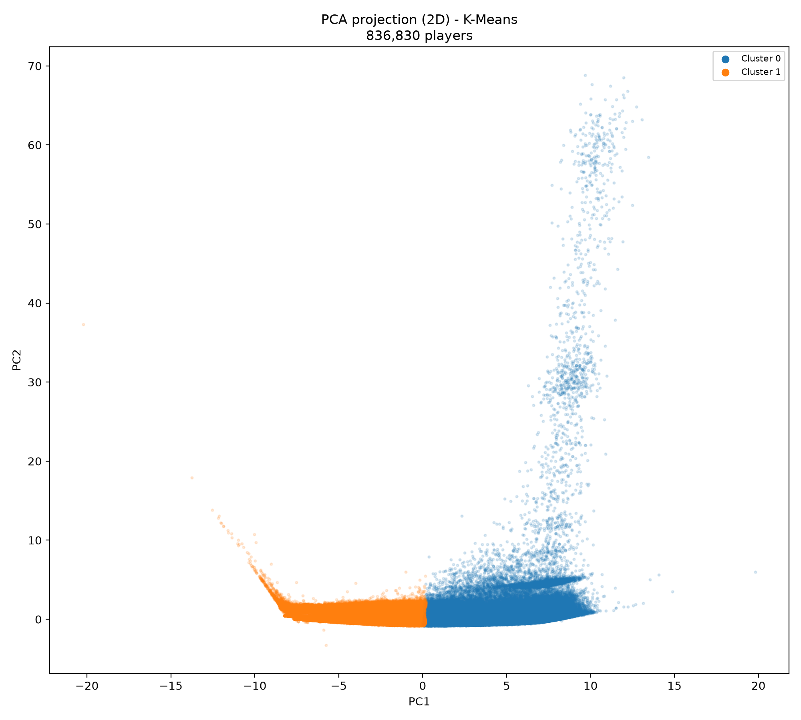

One exception: **current trophy count** is slightly *higher* in Cluster 1, showing that player profiles can't be reduced to a single progression variable — the clustering captures a broader combination of progression and activity.

#### DBSCAN

DBSCAN was tested to check for irregularly shaped groups K-Means might miss. **21 configurations** were evaluated; the best used `eps = 0.3`, `min_samples = 20`:

| Parameter | Value |
|---|---:|
| Clusters found | 160 |
| Noise points | 769,743 |
| Noise proportion | 91.98% |
| Silhouette Score | 0.1373 |

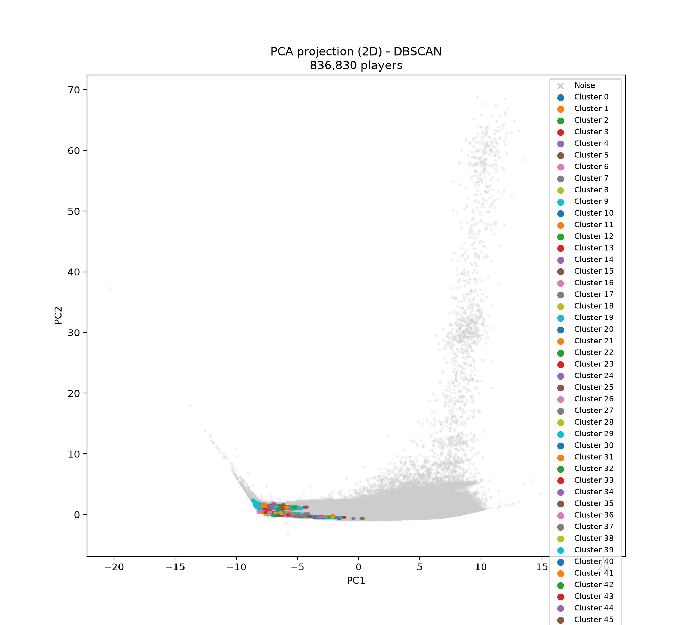

With **~92% of players classified as noise**, this was a **negative result** — the dataset didn't fit DBSCAN's assumptions well at this scale and parameterization, despite the larger number of clusters found.

#### Agglomerative Clustering

Running Agglomerative Clustering on the full ~836,000-player dataset was estimated to require roughly **2.55 TiB of memory** for the pairwise computations — impractical on the available hardware. This is a computational limitation, not an implementation error; the code exists in the repository, but the full experiment was never executed. Reducing the dataset to a smaller, representative subset was considered but rejected: the many dimensions and range of player profiles made it hard to justify that a manually selected subset would represent the population well enough for this experiment's objective.

#### Model Comparison

| Method | Result |
|---|---|
| **K-Means** | 2 meaningful, relatively balanced clusters |
| **DBSCAN** | 160 clusters, but ~91.98% of players classified as noise |
| **Agglomerative** | Not feasible on the full dataset (≈2.55 TiB memory) |

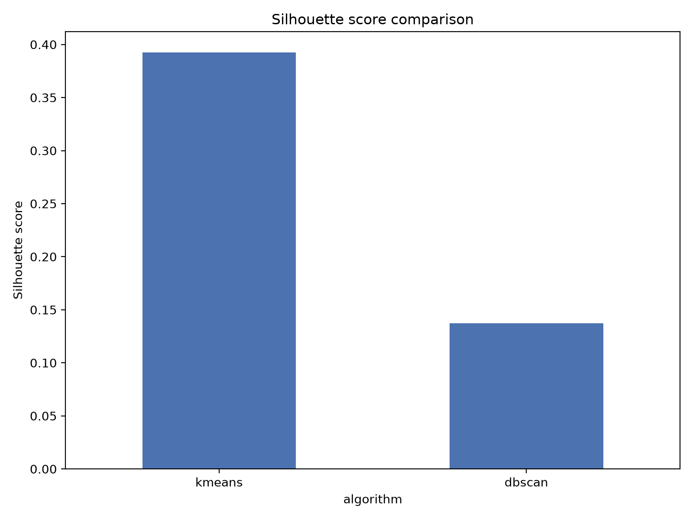

#### Analysis

The main result is that the player population splits into two broad profiles — more and less progressed/active — based on a combination of many features rather than any single variable. This also demonstrated that **more clusters isn't automatically a better result**: DBSCAN's 160 clusters were far less useful than K-Means' 2, once noise is accounted for. And an algorithm can be theoretically applicable to a problem while still being computationally impractical at scale, as Agglomerative Clustering showed here.

#### Key Takeaways

- P5 is the project's unsupervised problem: discovering player profiles with no predefined labels.
- ~836,000 players, 30 clustering features, standardized with `StandardScaler`.
- **K-Means (K = 2)** gave the best result: silhouette score **0.3926**, with relatively balanced clusters (404,225 / 432,605).
- The two clusters broadly represent more-progressed/active and less-progressed/active player profiles — though not every feature (e.g. current trophies) follows that pattern.
- **DBSCAN** found 160 clusters but classified **91.98%** of players as noise — not a useful result for this dataset.
- **Agglomerative Clustering** wasn't feasible on the full dataset due to memory requirements (~2.55 TiB).
- Unsupervised results need careful interpretation: without ground truth, "more clusters" or "more complex algorithm" doesn't imply a better result.

## 📈 Results Summary & Lessons Learned

### Results at a Glance

| Problem | Task | Best Model | Headline Result |
|---|---|---|---|
| **P1** | Role classification (4 classes) | Random Forest | 55.47% accuracy · 0.4980 macro F1 |
| **P2** | Clan rank regression | XGBoost + Optuna | R² = 0.9134 (with trophies) / 0.8805 (without) |
| **P3** | War success rate regression | Gradient Boosting + Optuna | R² = 0.2206 |
| **P4** | War performance classification (3 classes) | MLP + Optuna | 50.37% accuracy · 0.4962 macro F1 |
| **P5** | Player clustering | K-Means (K = 2) | Silhouette score = 0.3926 |

### Main Findings and Lessons Learned

- Tree-based models performed well across most supervised problems, particularly clan rank regression (P2).
- The best model depended on the specific problem and metric — a model with the best overall performance wasn't necessarily best for every class (XGBoost beat Random Forest on P1's `leader` F1-score despite Random Forest's higher overall accuracy).
- Feature availability and selection had a significant effect on performance; including trophy-related features clearly improved P2's results.
- Some problems — notably P3's historical war-performance analysis — remained difficult to model accurately even after testing more complex models and hyperparameter optimization.
- Reformulating a difficult regression problem as classification (P3 → P4) made the underlying signal more tractable to learn.
- Preventing target leakage was essential when building P4 from P3's underlying data.
- Unsupervised learning (P5) revealed broad player progression patterns, but the resulting clusters required careful interpretation — more clusters (DBSCAN) did not mean a better result than fewer (K-Means).
- Dataset size and computational cost directly shaped the evaluation strategy and choice of algorithms, particularly in P5.
- Overall, model performance depended as much on the quality, relevance, and limitations of the available data as on the choice of algorithm.

## 🔬 Machine Learning Engineering

The engineering layer is intentionally lightweight — not a production MLOps system, but a practical, reproducible experimentation workflow.

### Experiment Tracking with MLflow

**MLflow** has been part of the project from the start and is one of its most useful components — instead of treating every training run as an isolated experiment, it provides a centralized way to record what was done and compare results afterward. For every experiment, it tracks:

- Parameters
- Metrics
- Trained models
- Artifacts
- Dataset context
- Target information
- Dataset split configuration

The local setup uses **SQLite** as the backend store and local artifact storage:

```text
MLflow Server
      │
      ├── SQLite backend
      │       └── mlflow.db
      │
      └── Artifact storage
              └── mlflow/mlruns/
```

MLflow runs locally at `127.0.0.1:5000`.

### Dataset Context

Although all five problems share the same raw data, they don't share a final dataset — each has its own feature engineering, selected features, target, and construction process. Recording this **dataset context** in MLflow, along with the dataset split configuration, makes it possible to know exactly which dataset and target produced a given experiment's results — important when comparing across P1–P5, which look similar on the surface but represent fundamentally different problems.

### Reproducibility

Experiments consistently use `random_state = 42` where applicable, with the split configuration also logged in MLflow. This keeps the experimental setup consistent and makes it possible to reproduce results on another machine using the same code, data, and configuration.

### Reusable MLflow Tracking Layer

A shared tracking layer avoids reimplementing the same logging logic for every problem, covering:

```text
configure_tracking
mlflow_run
log_dataset_context
log_split_config
log_model_params
log_metrics
log_model_and_artifacts
```

This layer was extended as needed — for example, to support the **MLP** experiment in P4 — and some early metadata gaps (split configuration and dataset context not being fully logged) were identified and corrected during development.

### Model Logging

Early on, models were logged for every experiment run. Once **Optuna** was introduced, this changed: rather than logging every intermediate model from the optimization process, only the final selected model is logged after the best configuration is found — reducing unnecessary artifacts while keeping the final model tied to its experiment.

### Model Loading and Feature Consistency

A trained model isn't independent of the feature schema used to train it. P2 surfaced this directly: a saved XGBoost model was reloaded with a different feature set than the one it was trained on (see *P2 — Clan Rank Regression*, above, for the full story). The fix — retraining on the correct, aligned features and validating consistency through MLflow's model signatures and stored feature metadata — became standard practice for the rest of the project.

### Hyperparameter Optimization with Optuna

Early experiments relied more on manually adjusting parameters and observing the effect — useful for building intuition about what each hyperparameter actually controls, rather than treating models as black boxes. **Optuna** was introduced later for systematic search, evaluating configurations and progressively narrowing in on better-performing regions of the hyperparameter space. P4, for instance, used **50 trials** for both XGBoost and the MLP specifically to test whether a larger optimization budget than used elsewhere would produce a meaningful improvement.

Optuna served two purposes: **practical optimization** (efficiently searching a large space) and **understanding optimization behavior** (seeing how configurations affected performance and why). Automated search was most useful when paired with an understanding of what was actually being optimized, rather than used as a black box.

### Engineering Philosophy

The focus is on making experiments traceable, comparable, and reproducible — not on production infrastructure (see *Limitations & Technical Challenges* for the full picture of what is and isn't implemented):

```text
Raw Data
   ↓
Problem-Specific Dataset
   ↓
Feature Engineering
   ↓
Training
   ↓
Hyperparameter Optimization
   ↓
Evaluation
   ↓
MLflow
   ├── Parameters
   ├── Metrics
   ├── Models
   ├── Artifacts
   ├── Dataset Context
   └── Split Configuration
```

For this project's scope, that lightweight approach was enough to make experiments traceable, comparable, and reproducible.

### What I Learned

Experiment tracking becomes far more valuable once the number of experiments grows — MLflow made it possible to inspect metrics, compare configurations, and catch inconsistencies without manually keeping track of every run, which mattered as the project grew from simple experiments into five distinct ML problems. It also reinforced that **ML engineering isn't only about deployment** — keeping datasets, features, parameters, metrics, and models organized has a real impact on reproducibility even before deployment ever comes up. Similarly, Optuna showed the value of systematic hyperparameter search, best combined with an actual understanding of the models and hyperparameters involved.

## ⚙️ Installation

### Requirements

The project requires **Python 3.10+** and a virtual environment.

```powershell
git clone https://github.com/oteope/clash-of-clans-ml-lab.git
cd clash-of-clans-ml-lab

python -m venv .venv
.\.venv\Scripts\Activate.ps1
```

```powershell
python -m pip install --upgrade pip
pip install -r requirements.txt
```

Main dependencies:

- **MLflow** — experiment tracking and model management
- **pandas / NumPy** — data processing
- **scikit-learn** — machine learning algorithms and evaluation
- **XGBoost** — gradient boosting models
- **Optuna** — hyperparameter optimization
- **PyArrow** — Parquet dataset handling
- **Matplotlib / Seaborn** — visualization and EDA
- **aiohttp** — asynchronous API requests
- **python-dotenv** — environment variable management

### Clash of Clans API

Data collection requires a Clash of Clans Developer API key and your registered IP address, set as environment variables in a `.env` file in the project root:

```env
CLASH_API_KEY=your_api_key
CLASH_API_IP=your_expected_ip
```

These are only needed to run the data-collection pipeline, and should never be committed to the repository.

### Datasets

The processed `.parquet` datasets are excluded from the repository via `.gitignore` because of their size, so a fresh clone won't include them. Reproducing them requires running the full pipeline with a valid API configuration:

```text
Clash of Clans API
        ↓
Raw JSON Data
        ↓
Dataset Construction
        ↓
Feature Engineering
        ↓
Parquet Datasets
```

Raw data and generated datasets are stored locally under `data/`.

### MLflow

The project uses a local MLflow Tracking Server backed by SQLite. After installing dependencies, start it with:

```powershell
mlflow server `
  --backend-store-uri sqlite:///mlflow/mlflow.db `
  --default-artifact-root ./mlflow/mlruns `
  --host 127.0.0.1 `
  --port 5000
```

The UI is then available at `http://127.0.0.1:5000`. Point the ML pipeline at it with:

```powershell
$env:MLFLOW_TRACKING_URI = "http://127.0.0.1:5000"
```

If no external tracking URI is set, the project's tracking utilities fall back to the local SQLite configuration. See *Machine Learning Engineering*, above, for more on the MLflow setup.

## 🚀 Usage

```text
Data Extraction
      ↓
Feature Engineering & Dataset Construction
      ↓
Model Training / Clustering
      ↓
Hyperparameter Optimization
      ↓
Evaluation
      ↓
MLflow Results
```

### 1. Extract Raw Data

With API credentials configured:

```powershell
python src/extraction/main_extraction.py
```

Extracted data is stored under `data/raw/`.

### 2. Build the Dataset

Each problem has its own feature engineering and dataset-construction pipeline under:

```text
src/features/
├── problem1/
├── problem2/
├── problem3/
├── problem4/
└── problem5/
```

Run the builder for the problem you want, e.g.:

```powershell
python src/features/problem1/<build_problem1_name>_dataset.py
```

The same pattern applies to `problem2` through `problem5`.

### 3. Start MLflow

Start the local tracking server as described in *Installation*, and keep it running while you execute experiments. The UI is available at `http://127.0.0.1:5000`.

### 4. Run Machine Learning Experiments

Experiments are organized by problem under:

```text
src/models/
├── P1/
├── P2/
├── P3/
├── P4/
└── P5/
```

Depending on the experiment, hyperparameters are set manually or optimized with **Optuna**:

```powershell
python src/models/P1/<experiment_script>.py
```

The same pattern applies to `P2` through `P5`. Optuna-based experiments run their search automatically, then log the final selected model and results to MLflow.

### 5. Analyze Results

Each problem has its own results workflow. **P5 is the exception**: running its pipeline also produces problem-specific results, and the project additionally includes a global results analysis that consolidates the main findings across all five problems.

## 📁 Repository Structure

```text
clash-of-clans-ml-lab/
│
├── mlflow/
│   └── mlflow.db                  # Generated locally
│
├── mlflow_tracking/
│   ├── experiments.py
│   └── tracking_utils.py
│
├── notebooks/
│   └── eda/
│       ├── eda_p1.ipynb
│       ├── eda_p2.ipynb
│       ├── eda_p3.ipynb
│       ├── eda_p4.ipynb
│       └── eda_p5.ipynb
│
├── src/
│   ├── audit/
│   │   └── dataset_audit.py
│   │
│   ├── extraction/
│   │   ├── api_client.py
│   │   ├── config.py
│   │   ├── main_extraction.py
│   │   ├── search_config.py
│   │   └── storage.py
│   │
│   ├── features/
│   │   ├── problem1/
│   │   ├── problem2/
│   │   ├── problem3/
│   │   ├── problem4/
│   │   └── problem5/
│   │
│   ├── models/
│   │   ├── P1/
│   │   ├── P2/
│   │   ├── P3/
│   │   ├── P4/
│   │   └── P5/
│   │
│   ├── processing/
│   │   └── build_normalized_tables.py
│   │
│   ├── results/
│   │   ├── P1/
│   │   ├── P2/
│   │   ├── P3/
│   │   ├── P4/
│   │   └── P5/
│   │
│   ├── results_p1.py
│   ├── results_p2.py
│   ├── results_p3.py
│   ├── results_p4.py
│   └── results_p5.py
│
├── tests/
│   ├── test_api_client.py
│   ├── test_dataset_audit.py
│   ├── test_feature_engineering_problem1.py
│   ├── test_main_extraction.py
│   ├── test_mlflow_smoke.py
│   ├── test_problem2_feature_engineering.py
│   ├── test_problem3_feature_engineering.py
│   ├── test_problem4_feature_engineering.py
│   ├── test_problem5_feature_engineering.py
│   ├── test_processing.py
│   └── test_search_config.py
│
├── .gitignore
├── LICENSE
├── MLFLOW_SETUP.md
├── README.md
└── requirements.txt
```

### Directory Overview

| Directory / File | Description |
|---|---|
| `src/extraction/` | Data collection from the Clash of Clans Developer API — API communication, search configuration, and local storage. |
| `src/audit/` | Tools for auditing the collected raw data's structure and quality. |
| `src/processing/` | General-purpose data processing used before the problem-specific pipelines. |
| `src/features/` | Feature engineering and dataset construction for each problem. |
| `src/models/` | Machine learning experiments, organized by problem (`P1`–`P5`). |
| `src/results/` | Generated result artifacts per problem — metrics, plots, comparisons, summaries. |
| `src/results_p*.py` | Global result-analysis scripts, one per problem. |
| `mlflow_tracking/` | Reusable utilities for configuring MLflow and logging experiments, parameters, metrics, models, and artifacts. |
| `mlflow/` | Local MLflow SQLite database and tracking data, generated locally and not included in the repository. |
| `notebooks/eda/` | Exploratory Data Analysis notebooks for P1–P5. |
| `tests/` | Automated tests covering extraction, dataset auditing, feature engineering, processing, and MLflow functionality. |
| `MLFLOW_SETUP.md` | Detailed instructions for configuring and running the local MLflow tracking server. |
| `requirements.txt` | Python dependencies. |

### Problem Organization

Feature engineering is kept separate from model experimentation for every problem:

```text
src/features/problemX/
        ↓
Problem-Specific Dataset
        ↓
src/models/PX/
        ↓
Machine Learning Experiments
        ↓
src/results/PX/
        ↓
src/results_pX.py
```

This lets each generated dataset be reused across different models and experiments while keeping feature engineering independent of training.

### Results Organization

Each problem has a dedicated directory under `src/results/` holding its result artifacts — metric comparisons, confusion matrices, actual-vs-predicted plots, residual analysis, feature importance, cluster profiles, evaluation summaries, and CSV/JSON result files, depending on the problem. **P5** additionally has experiment-specific results for K-Means and DBSCAN, and `src/results_p5.py` provides the main consolidated analysis.

## ⚠️ Limitations & Technical Challenges

Building around real Clash of Clans data introduced constraints that shaped several design decisions throughout the project. Rather than hide them, they're documented here as part of the project's honest scope.

### Data Collection Constraints

The Clash of Clans Developer API allows only about **6–7 requests per minute**, making large-scale data collection slow. The crawler mitigates this by generating dozens of different clan-filter combinations (see *Data Collection*, above) rather than repeating the same generic queries — this doesn't remove the rate limit, but it makes each request more likely to surface new clans and players.

### P1 — Class Imbalance

Each clan has only **one leader**, so collecting more clans increases leader examples only in proportion to the number of clans — the `leader` class is fundamentally smaller than the others, not just under-sampled. **Class weighting** was used to compensate during training, but this is a limitation of the problem itself, not simply of data volume.

### P3 — Historical Performance vs. Future Prediction

P3's target reflects each clan's *existing* war record, not a genuinely unseen future outcome. A true future-prediction setup was considered — recording clans' current state, waiting for new war activity, and using it as a future outcome — but this would have required roughly **two months** of waiting, and only a limited number of clans had the required public war history available. Given the project's scope and the resulting drop in usable clans, this approach wasn't pursued. P3 should be read as an analysis of **historical/current** war performance, not a validated forecasting system.

### P5 — Computational Constraints

- **Silhouette analysis:** evaluating every candidate value of K on the full ~836,000-player dataset would have taken roughly **16 hours** — disproportionate to the goal — so a **50,000-player sample** was used for silhouette scoring. The full dataset was still used for the final K-Means clustering once K was chosen.
- **DBSCAN** produced a large number of small clusters and classified most of the dataset as noise — a clear example of an algorithm whose assumptions didn't match the data at this scale.
- **Agglomerative Clustering** would require an estimated **2.55 TiB of memory** on the full dataset. A smaller, manually selected subset was considered but rejected, since constructing one that stayed representative of the population's range of player characteristics was more effort than the experiment's value justified.

### MLflow Configuration Challenges

Incorrect MLflow server commands at one point created multiple empty `mlflow.db` files and tracking directories in different locations — a configuration issue, not a problem with MLflow itself. The lesson: tracking URI, backend store, and artifact location need to be configured consistently, which is why the project keeps its MLflow startup command explicitly documented rather than reconstructed from memory each time.

### Project Scope

This is intentionally **not a production MLOps system** — it's a serious personal project focused on exploring machine learning in depth and introducing real ML engineering practices, not on replicating a full production platform.

**Included:** extensive EDA, dataset construction and feature engineering, multiple supervised and unsupervised algorithms, model comparison, hyperparameter optimization, evaluation metrics, result visualization, MLflow experiment tracking, and reproducible experiment configuration.

**Not currently included:** Docker-based deployment, Kubernetes, CI/CD, cloud infrastructure, model serving, production monitoring, or automated retraining (see *Roadmap*, below, for possible future directions).

### What These Limitations Taught Me

Machine learning isn't only about choosing an algorithm and tuning it — real projects are also shaped by data availability, API limits, class distributions, target definitions, computational resources, algorithmic assumptions, and experiment management. Several experiments here (P3's regression, DBSCAN, Agglomerative Clustering) produced weaker or less-usable results than expected. Rather than treating that as failure, those cases became part of the analysis — showing where a given approach was appropriate, and where it wasn't.

## 🗺️ Roadmap

The project currently covers a complete machine learning laboratory workflow. Possible future directions include:

- Expanding the dataset with additional clans and players.
- Improving the data collection strategy to increase population diversity.
- Exploring additional feature engineering strategies for the existing problems.
- Testing additional algorithms and modeling approaches.
- Investigating more robust approaches to player clustering (P5).
- Building a true future war-performance prediction setup, if enough public war-history data becomes available.
- Strengthening the ML engineering layer with more automation and reproducibility.
- Potentially introducing Docker, CI/CD, model serving, and cloud infrastructure in a future iteration.

## 📚 References

- **Clash of Clans Developer API** — official documentation used for data collection.
- **MLflow** — experiment tracking, model logging, parameters, metrics, and artifacts.
- **scikit-learn** — machine learning algorithms, preprocessing, evaluation, and clustering.
- **XGBoost** — gradient boosting models used across the supervised problems.
- **Optuna** — hyperparameter optimization, used in P2, P3, and P4.
- **pandas** / **NumPy** — data manipulation and numerical computing.
- **PyArrow** — Parquet dataset storage and processing.
- **Matplotlib** / **Seaborn** — visualization and exploratory data analysis.
- **aiohttp** — asynchronous HTTP requests for data collection.
- **python-dotenv** — environment variable management.

## 📄 License

This project is licensed under the **MIT License**. See [`LICENSE`](LICENSE) for the full text.

## 👤 Author

**Oteope**

Machine Learning / MLOps enthusiast focused on building practical machine learning systems and understanding the engineering behind them.

GitHub: [Oteope](https://github.com/oteope)